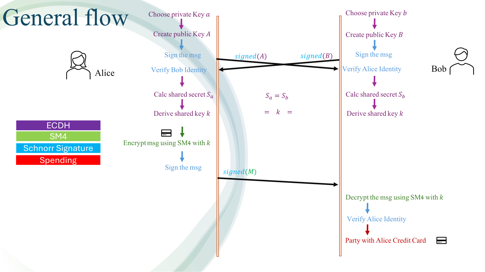

# Secure Payment with Server Identification Using Schnorr Signature, SM4, and ECDH

## Overview

This project implements a secure payment system that ensures the authenticity of both the sender and the receiver, as well as the confidentiality and integrity of the transmitted data. The system is built using three fundamental cryptographic techniques:

- **Elliptic Curve Diffie-Hellman (ECDH) Key Exchange**: For securely exchanging cryptographic keys over an insecure channel.
- **SM4 Symmetric Encryption**: A block cipher standard used for encrypting and decrypting messages.
- **Schnorr Digital Signature**: For ensuring the authenticity and integrity of messages.

The project is implemented in Python, without relying on high-level cryptographic libraries, to provide a deeper understanding of the inner workings of these cryptographic algorithms.

## Project Components

### Flow of the Secure Payment System

### 1. Elliptic Curve Diffie-Hellman (ECDH) Key Exchange
- **Purpose**: Securely exchange cryptographic keys between two parties.
- **Process**:
  - Both parties generate private keys.
  - Each party computes their public key by multiplying a generator point on the elliptic curve with their private key.
  - A shared secret is calculated by multiplying the received public key with the private key.

### 2. SM4 Symmetric Encryption
- **Purpose**: Encrypt and decrypt messages to ensure data confidentiality.
- **Process**:
  - Encrypts plaintext using the SM4 algorithm with a 128-bit key.
  - Decrypts ciphertext back to plaintext using the same key.

### 3. Schnorr Digital Signature
- **Purpose**: Provide message authenticity and integrity, preventing man-in-the-middle attacks.
- **Process**:
  - The signer generates a private key and a corresponding public key.
  - The signer creates a random nonce, computes a hash of the message and nonce, and generates the signature.
  - The verifier uses the signer's public key and the signature to verify the message's authenticity and integrity.

## Implementation Flow

1. **Research**: Studied the theoretical foundations of ECDH, SM4, and Schnorr signatures, followed by basic simulations to understand their functionality.
2. **Implementation**: Developed the algorithms from scratch, then integrated them into a functional secure payment system. 

## Results

The project successfully demonstrates the following:
- **Secure key exchange** using ECDH.
- **Encryption and decryption** of messages using SM4.
- **Signing and verification** of messages using the Schnorr signature scheme.

## Conclusion

This project serves as a practical example of how cryptographic techniques can be used to create a secure communication system. By implementing these algorithms from scratch, the project offers valuable insights into the importance of each step in cryptographic processes and their application in real-world secure communication systems.